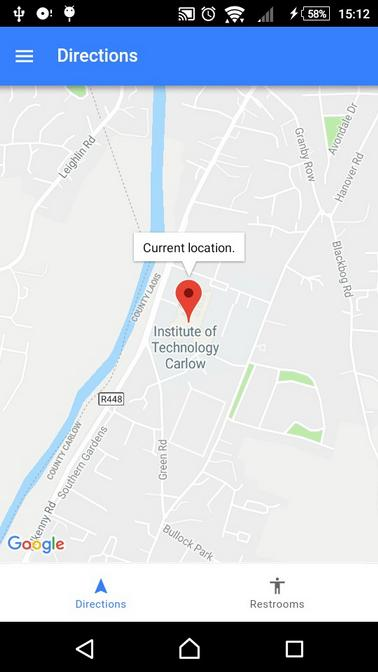

# Where2P4Free 
Mobile application for Android built using the Ionic framework. It assists users in finding free public restrooms nearest to them. 
GoogleMaps plugin for Ionic provides geolocation and map services. 

Location show on map:

Nearby locations listed:

Add new location:

